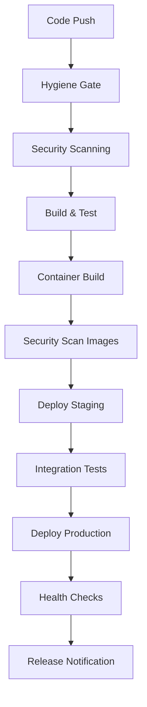

# Sprint 5: Comprehensive CI/CD Pipeline Strategy

## 🎯 Strategic Overview

Transform AirbarDashboard from basic CI/CD (40% maturity) to production-ready DevOps pipeline (85% maturity) through systematic implementation of security, testing, deployment, and release automation.

## 🏗️ Pipeline Architecture Design

### Multi-Stage Pipeline Structure



### Workflow Categories

#### 1. **Continuous Integration** (`ci-enhanced.yml`)
**Triggers:** Push to `main`, `develop`, PRs to `main`
**Purpose:** Code quality, security, and build validation
**Duration:** ~8-12 minutes

**Stages:**
- **Hygiene Gate** (2-3 min): Lint, format, type-check, deadcode analysis
- **Security Gate** (3-4 min): Vulnerability scanning, secrets detection, SAST
- **Build Gate** (2-3 min): Multi-package build validation, dependency checks
- **Test Gate** (3-4 min): Unit tests, coverage reporting, test quality metrics

#### 2. **Security Scanning** (`security-scan.yml`)
**Triggers:** Daily schedule, security-related file changes
**Purpose:** Comprehensive security assessment
**Duration:** ~15-20 minutes

**Scans:**
- **Dependency Vulnerabilities:** SNYK, npm audit, GitHub Advisory
- **Container Security:** Trivy, Docker security scanning
- **Code Security:** SAST with CodeQL, secret scanning
- **License Compliance:** FOSSA or license-checker integration

#### 3. **Deployment Pipeline** (`deploy-staging.yml`, `deploy-production.yml`)
**Triggers:** 
- Staging: Push to `develop`, successful CI
- Production: Tag creation, manual approval
**Purpose:** Multi-environment deployment automation

**Environments:**
- **Staging:** Automatic deployment for `develop` branch
- **Production:** Tag-based deployment with manual approval gates

#### 4. **Release Management** (`release.yml`)
**Triggers:** Manual workflow dispatch, tag creation
**Purpose:** Automated versioning, changelog, and release creation

## 📋 Detailed Implementation Plan

### Phase 1: Enhanced CI Pipeline (Days 1-2)

#### 1.1 Security Integration
```yaml
# New security scanning jobs
security-scan:
  - dependency-check: SNYK + npm audit
  - secrets-scan: GitHub secret scanning + TruffleHog
  - sast-scan: CodeQL integration
  - license-check: License compatibility validation
```

#### 1.2 Advanced Testing Framework
```yaml
test-suite:
  - unit-tests: Jest with coverage reporting
  - integration-tests: API endpoint testing
  - e2e-tests: Playwright browser automation
  - performance-tests: Lighthouse CI integration
```

#### 1.3 Build Optimization
```yaml
build-enhancements:
  - workspace-caching: pnpm store and node_modules caching
  - parallel-builds: Job matrix for API/Web builds
  - build-artifacts: Artifact upload/download between jobs
  - build-metrics: Build time and size tracking
```

### Phase 2: Container & Deployment Pipeline (Days 3-4)

#### 2.1 Container Registry Integration
```yaml
container-workflow:
  - registry: DockerHub or AWS ECR integration
  - image-tagging: Semantic versioning for images
  - multi-arch: AMD64/ARM64 builds for production
  - vulnerability-scanning: Trivy integration for images
```

#### 2.2 Multi-Environment Deployment
```yaml
environments:
  staging:
    trigger: develop branch push
    approval: automatic
    rollback: automatic on health check failure
  production:
    trigger: tag creation
    approval: manual (maintainers only)
    rollback: manual with one-click capability
```

#### 2.3 Infrastructure as Code
```yaml
infrastructure:
  - docker-compose: Production-ready compose files
  - secrets-management: GitHub Secrets integration
  - environment-variables: Secure env var management
  - health-monitoring: Deployment health validation
```

### Phase 3: Release Automation (Days 5-6)

#### 3.1 Semantic Versioning
```yaml
versioning:
  - conventional-commits: Commit message enforcement
  - automated-versioning: semantic-release integration
  - changelog-generation: Automatic CHANGELOG.md updates
  - git-tagging: Automated tag creation with proper formatting
```

#### 3.2 Release Management
```yaml
release-process:
  - pre-release: Alpha/beta release channels
  - release-notes: Automated GitHub release creation
  - asset-uploading: Build artifacts attached to releases
  - notification: Slack/Discord integration for releases
```

## 🔐 Security Implementation Strategy

### 1. Dependency Security
- **SNYK Integration:** Real-time vulnerability monitoring
- **Dependabot:** Automated dependency updates
- **npm audit:** Package vulnerability scanning
- **License Scanning:** Open source compliance checking

### 2. Code Security
- **GitHub CodeQL:** SAST scanning for security vulnerabilities
- **Secret Scanning:** Detection of hardcoded secrets/tokens
- **TruffleHog:** Advanced secret detection in git history
- **Security Policy:** .github/SECURITY.md with reporting process

### 3. Container Security
- **Trivy Scanning:** Container vulnerability assessment
- **Base Image Updates:** Automated base image security updates
- **Non-root Execution:** Enforced non-root container execution
- **Minimal Images:** Distroless or minimal Alpine images

### 4. Infrastructure Security
- **Secrets Management:** GitHub Secrets for sensitive data
- **RBAC:** Role-based access control for deployments
- **Network Security:** Secure container networking
- **Audit Logging:** Comprehensive security event logging

## 🧪 Testing Strategy

### 1. Unit Testing Enhancement
```typescript
// Enhanced test configuration
{
  "coverage": {
    "threshold": {
      "global": {
        "branches": 80,
        "functions": 80,
        "lines": 80,
        "statements": 80
      }
    }
  }
}
```

### 2. Integration Testing
- **API Testing:** Automated endpoint testing with Newman/Postman
- **Database Testing:** Migration and seed validation
- **Service Integration:** Cross-service communication testing
- **External API Mocking:** Third-party service simulation

### 3. End-to-End Testing
- **Playwright Integration:** Multi-browser E2E testing
- **User Journey Testing:** Critical path automation
- **Visual Regression:** Screenshot comparison testing
- **Performance Testing:** Core Web Vitals validation

### 4. Performance Testing
- **Lighthouse CI:** Automated performance audits
- **Bundle Analysis:** JavaScript bundle size monitoring
- **Load Testing:** API endpoint stress testing
- **Database Performance:** Query performance monitoring

## 🚀 Deployment Strategy

### 1. Environment Management
```yaml
environments:
  development:
    url: localhost:3001 / localhost:5173
    database: airbar_dev
    cache: local redis
    
  staging:
    url: staging.airbar.com
    database: airbar_staging (RDS)
    cache: ElastiCache
    monitoring: CloudWatch
    
  production:
    url: app.airbar.com
    database: airbar_prod (RDS with backups)
    cache: ElastiCache (cluster mode)
    monitoring: Full observability stack
```

### 2. Deployment Strategies
- **Staging:** Automatic deployment on `develop` push
- **Production:** Blue/green deployment with health checks
- **Rollback:** Automated rollback on health check failures
- **Canary:** Gradual traffic shift for major releases

### 3. Health Monitoring
```yaml
health-checks:
  application:
    - endpoint: /api/health
    - database: connection validation
    - cache: redis connectivity
    - external-services: third-party API health
  
  infrastructure:
    - container-health: Docker health checks
    - resource-monitoring: CPU/Memory thresholds
    - log-monitoring: Error rate thresholds
    - uptime-monitoring: External uptime checks
```

## 📊 Quality Gates & Metrics

### 1. Code Quality Thresholds
```yaml
quality-gates:
  code-coverage: >= 80%
  security-vulnerabilities: 0 high/critical
  performance-budget: 
    - bundle-size: < 500KB gzipped
    - lighthouse-score: > 90
  dependency-freshness: < 30 days outdated
```

### 2. Build Performance Metrics
```yaml
performance-tracking:
  build-time: Target < 10 minutes
  test-execution: Target < 5 minutes
  deployment-time: Target < 3 minutes
  pipeline-success-rate: Target > 95%
```

### 3. Security Metrics
```yaml
security-kpis:
  vulnerability-detection: < 24 hours
  patch-deployment: < 7 days for critical
  secret-scanning: 100% commit coverage
  compliance-score: Target > 95%
```

## 🔄 Continuous Improvement

### 1. Pipeline Optimization
- **Caching Strategy:** Aggressive caching for dependencies and build artifacts
- **Parallel Execution:** Job parallelization for faster feedback
- **Resource Optimization:** Right-sizing runners and containers
- **Feedback Loops:** Developer experience improvement based on metrics

### 2. Monitoring & Alerting
- **Pipeline Health:** Success/failure rate monitoring
- **Performance Trends:** Build time trend analysis
- **Security Alerts:** Real-time vulnerability notifications
- **Cost Optimization:** Resource usage and cost tracking

### 3. Developer Experience
- **Fast Feedback:** Quick failure detection and clear error messages
- **Local Development:** Dev environment parity with production
- **Documentation:** Comprehensive CI/CD documentation
- **Training:** Team onboarding for new CI/CD processes

## 📈 Success Metrics

### Technical KPIs
- **Deployment Frequency:** Daily deployments to staging, weekly to production
- **Lead Time:** < 2 hours from code commit to staging deployment
- **Mean Time to Recovery:** < 30 minutes for critical issues
- **Change Failure Rate:** < 10% of deployments require rollback

### Quality KPIs
- **Security Vulnerabilities:** 0 high/critical vulnerabilities in production
- **Test Coverage:** > 80% code coverage across all packages
- **Performance:** All Core Web Vitals in "Good" range
- **Reliability:** 99.9% uptime for production services

### Team KPIs
- **Developer Satisfaction:** > 4.5/5 for CI/CD experience
- **Time to Value:** < 1 day for new developer setup
- **Knowledge Sharing:** 100% team CI/CD knowledge coverage
- **Process Adoption:** 100% workflow compliance

---

**This comprehensive strategy transforms AirbarDashboard into a production-ready platform with enterprise-grade CI/CD capabilities, setting the foundation for reliable, secure, and scalable software delivery.**