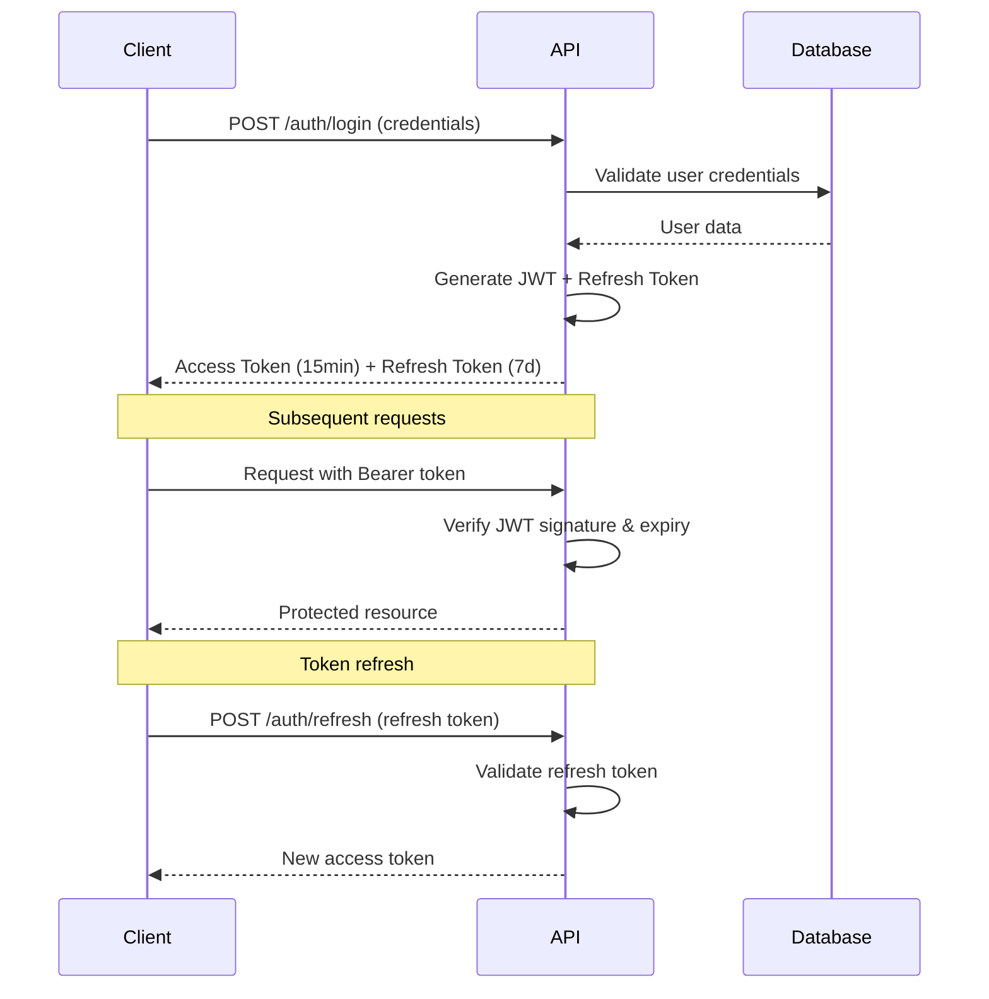

# Airbar API Documentation

*REST API overview and authentication guide for the Airbar crowdshipping platform*

---

## 📡 API Overview

The Airbar API provides programmatic access to the crowdshipping platform, enabling integration with trip management, package handling, user authentication, and payment processing.

**Base URL**: `http://localhost:3001/api` (development)
**Version**: v1
**Authentication**: JWT Bearer tokens

---

## 🔐 Authentication

### JWT Token System
Airbar uses **JSON Web Tokens (JWT)** for stateless authentication with refresh token rotation.

**Implementation**: [`apps/api/src/features/auth/middleware/auth.ts:15-45`](../../../apps/api/src/features/auth/middleware/auth.ts)

### Authentication Flow



### Headers Required

```http
Authorization: Bearer <access_token>
Content-Type: application/json
```

### Token Expiry
- **Access Token**: 15 minutes
- **Refresh Token**: 7 days
- **Auto-refresh**: Required for long sessions

---

## 📚 API Endpoints

### Authentication Endpoints
| Method | Endpoint | Description |
|--------|----------|-------------|
| `POST` | `/auth/login` | User login |
| `POST` | `/auth/register` | User registration |
| `POST` | `/auth/logout` | User logout |
| `POST` | `/auth/refresh` | Refresh access token |
| `GET` | `/auth/session` | Get current session |

### User Management
| Method | Endpoint | Description |
|--------|----------|-------------|
| `GET` | `/user/:id` | Get user profile |
| `PUT` | `/user/:id` | Update user profile |
| `POST` | `/user/kyc` | Submit KYC verification |
| `POST` | `/user/avatar` | Upload profile avatar |

### Trips & Travel
| Method | Endpoint | Description |
|--------|----------|-------------|
| `GET` | `/trips` | List available trips |
| `GET` | `/trips/:id` | Get trip details |
| `POST` | `/trips` | Create new trip |
| `PUT` | `/trips/:id` | Update trip |
| `DELETE` | `/trips/:id` | Cancel trip |

### Package Management
| Method | Endpoint | Description |
|--------|----------|-------------|
| `GET` | `/packages` | List package requests |
| `GET` | `/packages/:id` | Get package details |
| `POST` | `/packages` | Create package request |
| `PUT` | `/packages/:id` | Update package |
| `DELETE` | `/packages/:id` | Cancel package |

### Matching System
| Method | Endpoint | Description |
|--------|----------|-------------|
| `GET` | `/matches` | List user matches |
| `GET` | `/matches/:id` | Get match details |
| `POST` | `/matches` | Request match |
| `PATCH` | `/matches/:id` | Update match status |

### Payments & Escrow
| Method | Endpoint | Description |
|--------|----------|-------------|
| `POST` | `/payments/checkout` | Create payment session |
| `POST` | `/payments/confirm` | Confirm payment |
| `GET` | `/payments/status/:id` | Payment status |
| `POST` | `/webhooks/stripe` | Stripe webhook |

### Notifications
| Method | Endpoint | Description |
|--------|----------|-------------|
| `GET` | `/notifications` | List notifications |
| `GET` | `/notifications/unread` | Unread count |
| `PUT` | `/notifications/:id/read` | Mark as read |
| `PUT` | `/notifications/read-all` | Mark all read |

---

## 📝 Request/Response Format

### Standard Response Structure
```json
{
  "success": true,
  "data": {
    // Response data
  },
  "message": "Operation successful",
  "timestamp": "2025-01-24T12:00:00Z"
}
```

### Error Response Structure
```json
{
  "success": false,
  "error": {
    "code": "VALIDATION_ERROR",
    "message": "Invalid input data",
    "details": {
      "field": "email",
      "issue": "Must be valid email format"
    }
  },
  "timestamp": "2025-01-24T12:00:00Z"
}
```

### Common HTTP Status Codes
- `200` - Success
- `201` - Created
- `400` - Bad Request
- `401` - Unauthorized  
- `403` - Forbidden
- `404` - Not Found
- `422` - Validation Error
- `500` - Server Error

---

## 🛡️ Security Features

### Rate Limiting
**Implementation**: [`apps/api/src/server.ts:25-35`](../../../apps/api/src/server.ts)

```javascript
// API rate limits per IP
- General: 100 requests/15 minutes
- Auth endpoints: 5 attempts/15 minutes
- Password reset: 3 attempts/hour
```

### Security Middleware
- **CORS**: Cross-origin request handling
- **Helmet**: Security headers
- **bcrypt**: Password hashing (12 rounds)
- **Input validation**: Zod schema validation
- **SQL injection**: Prisma ORM protection

### Authentication Middleware
```typescript
// Role-based access control
interface AuthMiddleware {
  requireAuth(): Express.Handler;
  requireRole(role: UserRole): Express.Handler;
  optionalAuth(): Express.Handler;
}
```

---

## 📊 Database Integration

### Prisma ORM
**Schema**: [`prisma/schema.prisma`](../../../prisma/schema.prisma)
- **15 entities** for comprehensive data modeling
- **Type-safe** database queries
- **Migration system** for schema evolution

### Key Entities
- `User` + `Profile` - User management
- `Session` - Authentication sessions  
- `Trip` + `Location` - Travel data
- `Package` + `Match` - Package matching
- `Transaction` - Payment records
- `Notification` - User notifications
- `Dispute` - Conflict resolution

---

## 🚀 Getting Started

### 1. Environment Setup
```bash
# Clone repository
git clone <repo-url>
cd AirbarDashboard

# Install dependencies  
pnpm install

# Setup environment
cp .env.example .env
# Configure DATABASE_URL, JWT_SECRET, etc.

# Database setup
pnpm db:migrate
pnpm db:seed
```

### 2. Start Development Server
```bash
# Start API server
pnpm dev:api

# API available at: http://localhost:3001
# Health check: http://localhost:3001/api/health
```

### 3. Test API Connection
```bash
# Health check
curl http://localhost:3001/api/health

# Register user
curl -X POST http://localhost:3001/api/auth/register \
  -H "Content-Type: application/json" \
  -d '{"email":"test@example.com","password":"password123","name":"Test User"}'
```

---

## 📖 Additional Resources

### Related Documentation
- **[Authentication Flow](./authentication.md)** - Detailed auth implementation
- **[API Endpoints](./endpoints.md)** - Complete endpoint reference  
- **[Database Schema](../architecture/database-schema.md)** - Data model overview
- **[Development Setup](../development/setup.md)** - Local development guide

### External Resources
- [Prisma Documentation](https://www.prisma.io/docs/)
- [JWT.io](https://jwt.io/) - Token debugging
- [Stripe API](https://stripe.com/docs/api) - Payment integration

---

## ⚠️ Current Limitations

### API Completion Status
- **Authentication**: ✅ Fully implemented
- **User Management**: ✅ Core functionality complete
- **Trips**: ⚠️ CRUD operations, business logic pending
- **Packages**: ⚠️ CRUD operations, matching logic pending  
- **Payments**: ⚠️ Stripe integration in progress
- **Notifications**: ⚠️ Basic structure, real-time pending

### Known Issues
- Stripe webhook validation pending
- Real-time notifications require WebSocket implementation
- Advanced matching algorithm needs business logic
- File upload endpoints require implementation

---

*For specific endpoint documentation, see [API Endpoints Reference](./endpoints.md)*